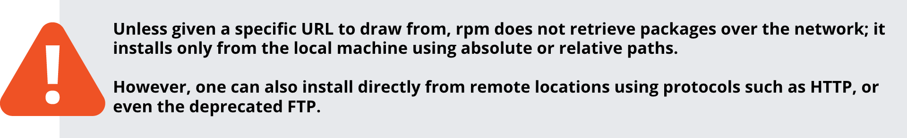

# Chapter 10 - RPM

- RPM is a Package Management Utility for Red Hat. It originally stood for Redhat Package Manager.
- All files related to a specific task or subsystem are packaged into a single file, which also contains information about how and where to install and uninstall the files. 
- When developers create a new version of a program, they usually release a new RPM package.

The standard naming format for a binary RPM package is:

**\<name>-\<version>-\<release>.\<distro>.\<architecture>.rpm**  
**sed-4.5-2.e18.x86_64.rpm**  

The standard naming format for a source RPM package is:

**\<name>-<version>-<release>.<distro>.src.rpm**  
**sed-4.5-2.e18.src.rpm**  

Note that the distro field often actually specifies the repository that the package came from, as a given installation may use a number of different package repositories, 
as we shall see when we discuss dnf, yum and zypper which work at a level above RPM.

The default system directory which holds the RPM database files is */var/lib/rpm*, but these files should never be modified. They should updated using the rpm program.

You can use the --rebuilddb option to rebuild the database indices from the installed package headers; this is more of a repair, and not a rebuild from scratch.

**$ sudo rpm --rebuilddb**

## Queries

- -f: allows you to determine which package a file came from
- -l: lists the contents of a specific package
- -a: all the packages installed on the system
- -i: information about the package
- -p: run the query against a package file instead of the package database

| Task           |         Command |
|----------------|-------------------------|
| Which version of a package is installed?                                            | **$ rpm -q bash**                     |
| Which package did this file come from?                                              | **$ rpm -qf /bin/bash**               |
| What files were installed by this package?                                          | **$ rpm -ql bash**                    |
| Show information about this package                                                 | **$ rpm -qi bash**                    |
| Show information about this package from the package file, not the package database | **$ rpm -qip foo-1.0.0-1.noarch.rpm** | 
| List all installed packages on this system                                          | **$ rpm -qa**                         |

## Verifying Packages

The -V option to rpm allows you to verify whether the files from a particular package are consistent with the system’s RPM database. Use the rpm -Va command to verify all packages on the system.

- **S**: filesize differs
- **M**: mode differs (permissions and file type)
- **5**: MD5 sum differs
- **D**: device major/minor number mismatch
- **L**: readLink path mismatch
- **U**: user ownership differs
- **G**: group ownership differs
- **T**: mTime differs

In the output (you only see output if there is a problem) each of the characters denotes the result of a comparison of attribute(s) of the file to the value of
those attribute(s) recorded in the database. A single "." (period) means the test passed, while a single "?" (question mark) indicates the test could not be 
performed (e.g. file permissions prevent reading). Otherwise, the character denotes the failure of the corresponding --verify test.

## Installing Packages

RPM performs a number of tasks when installing a package:

- Dependency checks
- Conflict checks
- Commands required before installation
- Handles configuration files with intelligent care
- Unpacks files from package and installs them with correct attributes
- Commands required after installation
- Updates system RPM database
- To install a package, the rpm -i command is used, as in:

**$ sudo rpm -ivh bash-4.4.19-12.el8_0.x86_64**

Dependency checks are necessary because some packages will not operate properly unless some other package is also installed.

Conflicts include attempts to install an already-installed package, or to install an older version over a newer version.

## Uninstalling Packages

The -e option causes rpm to uninstall (erase) a package. Normally, the rpm -e command fails with an error message if the package you are attempting to uninstall is required by other packages on the system. A successful uninstall produces no output.

Command:

**$ sudo rpm -e system-config-lvm**

Output:

**package system-config-lvm is not installed**

## Freshening Packages

The command:

**$ sudo rpm -Fvh \*.rpm**

will attempt to freshen all the packages in the current directory. The way this works is:

- If an older version of a package is installed, it will be upgraded to the newer version in the directory.
- If the version on the system is the same as the one in the directory, nothing happens.
- If there is no version of a package installed, the package in the directory is ignored.

Both upgrading and freshening will install a new package if the original package is already loaded.

The -F option is useful when you have downloaded several new patches and want to upgrade the packages that are already installed, but not install any new ones.

Freshening can be useful for applying a lot of patches (i.e., upgraded packages) at once.

## Upgrading the Linux Kernel

An install of the new Linux kernel requires a reboot (most updates don't). If you upgraded the kernel,
the old kernel would be removed and if the new kernel has any issues, you can't revert. This is why you should install (**-i**), and have both kernels coexisting, choosing to booth into either. To install a new kernel on a Red Hat system:

**$ sudo rpm -ivh kernel-{version}.{arch}.rpm**

This will automatically update the GRUB configuration file to include the new version, and it will
be the default choice at boot. After the new kernel is tested, you can remove the old version, although it isn't necessary. Keeping older kernels available is recommended.

To remove older versions of the kernel:

**$ sudo dnf remove --oldinstallonly**

Be careful when using this command!
